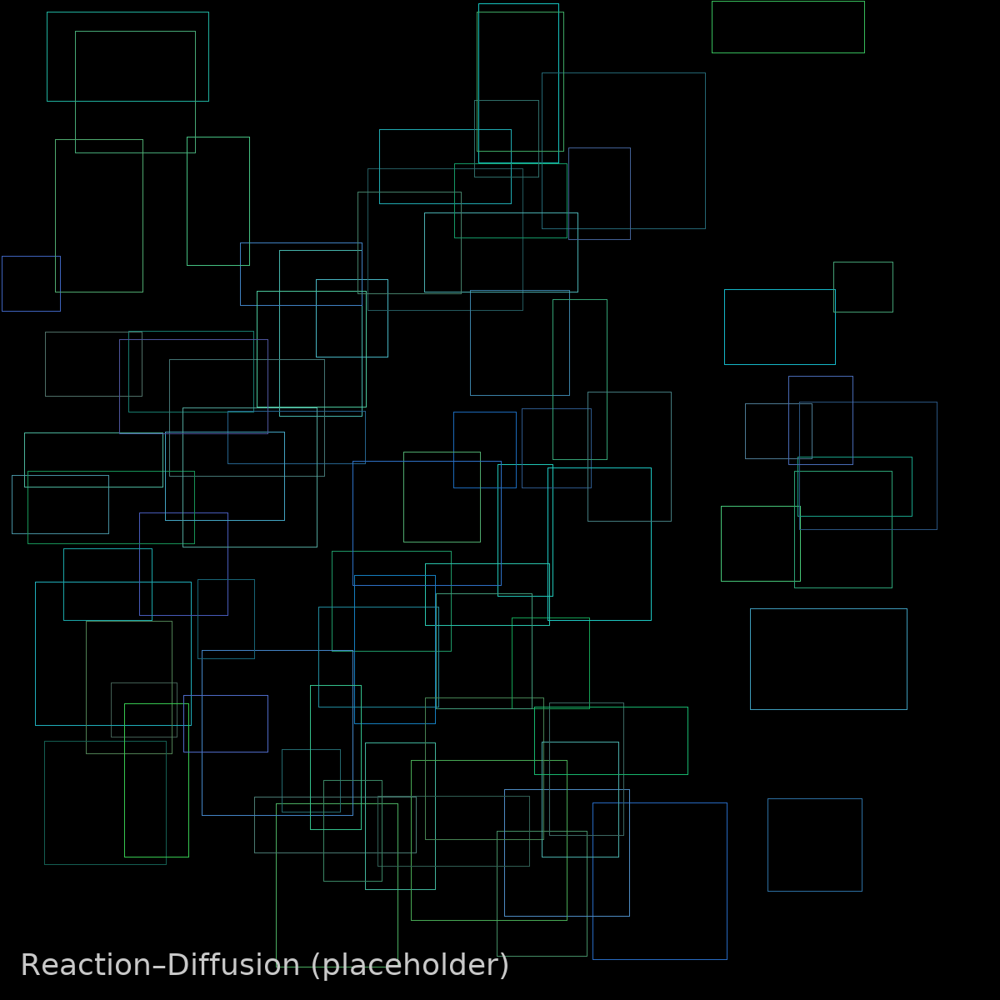

# Reaction–Diffusion (RD)

このアプリは **反応拡散（Gray–Scott モデル）** を CPU でリアルタイムに可視化する PWA です。  
**ヒョウ柄・シマ模様・迷路状パターン** など “自然の模様” を生成します。

- 画面は常に **正方形** に保たれ、モバイルでも縦横比が崩れません。
- **PWA** 対応（ホーム画面に追加 / オフライン起動）
- **強制リセット**（Service Worker / Cache / Storage 全消去）付き：`force-reset.html`

## スクリーンショット

## 操作
- Start / Stop / Reset ボタン
- パラメータ（F, K, DiffU, DiffV）とプリセット（Spots/Stripes/Maze/Worms）
- キー操作：**R**=Reset、**K**=Kill、**F12**=Hard Reset（※DevToolsが開く場合あり）
- コンソール：`window.kill()`, `window.resetRD()`, `window.hardReset()`

## デプロイ（GitHub Pages）
1. 本フォルダの中身をリポジトリ直下へ配置
2. Settings → Pages → Branch: `main` / folder: `/root` を選択
3. 旧キャッシュが残る場合は `/force-reset.html` を開いて **Clean & Reload**

---

**注意**: ここでは Gray–Scott でのパターン生成を実装しています（論文の厳密な拡散泳動モデルではありません）。
論文に近い見た目（“美しく不完全”な粒子由来のブロッチ）に寄せる**Imperfect-like**レンダリングは、将来的に WebGL2 / compute での高速化と併せてブランチを分けて統合可能です。
